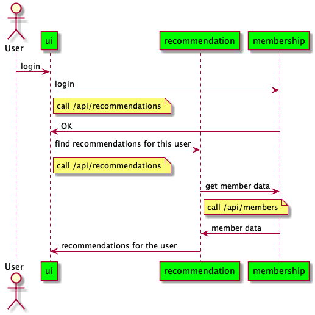

# ui
This repository was cloned from https://github.com/metflix/ui with following extensions:
- Divided components for easily understand each responsibility
- Added unit tests by using Mocks

<br>


## Overview


ui, [recommendations](https://github.com/hageyahhoo/recommendations), and [membership](https://github.com/hageyahhoo/membership) are Microservices.

<br>


## How to run this service
Please run [src/main/java/com/metflix/UiApplication.java](https://github.com/hageyahhoo/ui/blob/master/src/main/java/com/metflix/UiApplication.java).

<br>


## How to run tests
Please run the following command.
```
./mvnw clean build
```
